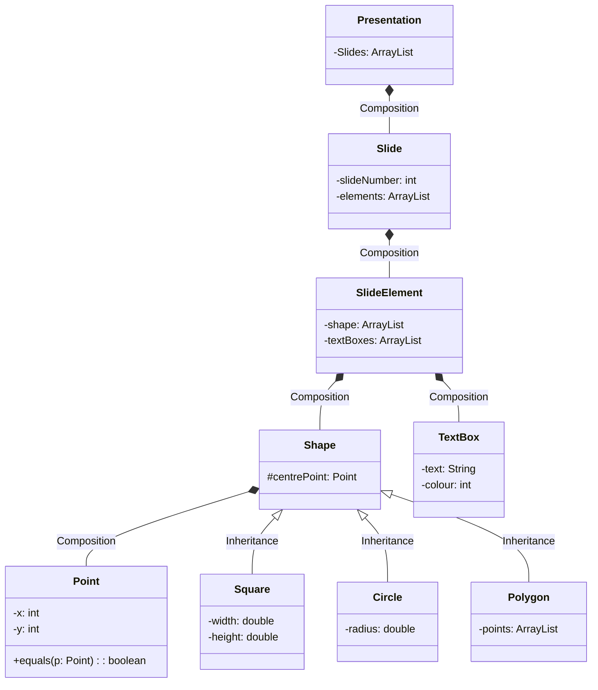

## OOD Lab 7

### Assignment 7 | UML

- Put your name and student number in a comment at the top of each file.
- Ensure that your code is well formatted e.g. lines after an opening brace should be indented. Each closing brace should be at the same indentation as the statement which opened it. (Use Ctrl + Shift + F if using Eclipse)
- It is compulsory to comment your code appropriately. For each of the exercises ensure that your code is sufficiently commented to demonstrate your understanding of the software you are writing. You do not have to comment every line however.
- Marks will be lost if the above instructions are not followed.

1. Create a Java project with a package named with your student details in the following format lastname_firstname_studentID_assignment_7.
   - In the package write a java program using the structure defined in the class diagram below.
   - It is essential to comment where you use Composition and Inheritance as defined in the diagram.
   - Write a test class called TestingClass to run your program.

> What do I submit?
> Submit your program as per submission instructions. As a reminder you can view these here https://moodle.griffith.ie/mod/resource/view.php?id=15386
